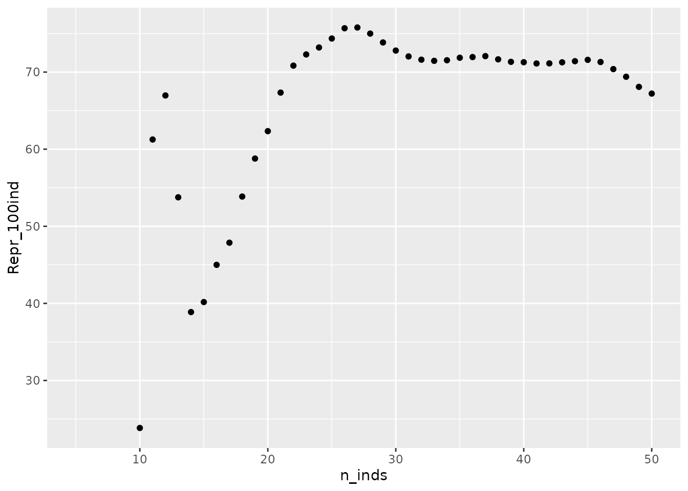

# Uncertainty_in_Repr

``` r
library(ColonyRepr)
#> Registered S3 methods overwritten by 'adehabitatMA':
#>   method                       from
#>   print.SpatialPixelsDataFrame sp  
#>   print.SpatialPixels          sp
#> Warning: replacing previous import 'dplyr::lag' by 'stats::lag' when loading
#> 'ColonyRepr'
#> Warning: replacing previous import 'dplyr::filter' by 'stats::filter' when
#> loading 'ColonyRepr'
library(tidyverse)
#> ── Attaching core tidyverse packages ──────────────────────── tidyverse 2.0.0 ──
#> ✔ dplyr     1.1.4     ✔ readr     2.1.6
#> ✔ forcats   1.0.1     ✔ stringr   1.6.0
#> ✔ ggplot2   4.0.1     ✔ tibble    3.3.0
#> ✔ lubridate 1.9.4     ✔ tidyr     1.3.2
#> ✔ purrr     1.2.0
#> ── Conflicts ────────────────────────────────────────── tidyverse_conflicts() ──
#> ✖ dplyr::filter() masks stats::filter()
#> ✖ dplyr::lag()    masks stats::lag()
#> ℹ Use the conflicted package (<http://conflicted.r-lib.org/>) to force all conflicts to become errors
```

.

### Determining uncertainty

In determining colony representativeness, we assume that the fitted
MM-curve accurately describes the trajectory of increasing the number of
tracked individuals over time. Since we make an estimate of the expected
within-colony variation directly based on the parameter-values from the
fitted MM-curve, which we then use to determine captured colony
representativeness, the robustness of the MM-fit will directly influence
the uncertainty around our calculated estimate of colony
representativeness. Let’s describe an example. You have tracked 20
individuals from a certain colony and performed the analysis described
above. The MM-curve is now fitted to 20 data points. The next year, you
track another individual and add this to your dataset. Now, you’ll fit
the curve to 21 data points. Ideally, the parameters of the curve
wouldn’t change. However, this is not the case, as the new information
will influence the fit. Consequently, you’ll extract different parameter
values from your second fit compared to your first fit. If these values
are similar to the ones from your first fit, great! Your estimated
colony representativeness will increase as predicted with the addition
of this extra individual. However, if the parameter values of the second
fit differ a lot from those of your first fit, your estimate of captured
colony representativeness will vary accordingly. You can assume that
your second calculation is closer to the truth, but you don’t know how
close.  
In the following analysis, we will investigate how a fitted
Michaelis-Menten curve changes as the sample size of tracked individuals
increases. For all fitted MM-curves, we can then determine how many
individuals (n_to_track) we’d need to track to achieve a certain level
of colony representativeness, in our case 50%. If all fitted curves are
very similar, n_to_track will not differ a lot among the different fits,
indicating a robust fitting process. However, as we’ll see, the fitting
is not always as robust.  
  
We can fit a MM-curve to all possible sample sizes (\>5) within our
colony sample using `KDE_Repr_per_individual_fun`.

``` r
Repr_per_ind <- KDE_repr_per_individual_fun(combined_areas_df = Combine$Kernel_areas)
Repr_per_ind
#> # A tibble: 7 × 12
#>   species      colony  month n_inds   mean     sd up_bound low_bound KDE_contour
#>   <chr>        <chr>   <dbl>  <int>  <dbl>  <dbl>    <dbl>     <dbl>       <dbl>
#> 1 species_name colony…    12      5 2.42e5 31240.  273511.   211031.          50
#> 2 species_name colony…    12      6 2.89e5 27822.  316779.   261136.          50
#> 3 species_name colony…    12      7 3.28e5 36853.  364813.   291107.          50
#> 4 species_name colony…    12      8 3.62e5 36505.  398780.   325770.          50
#> 5 species_name colony…    12      9 4.23e5 29215.  452296.   393866.          50
#> 6 species_name colony…    12     10 4.59e5 17590.  476548.   441368.          50
#> 7 species_name colony…    12     11 5.01e5     0   500707.   500707.          50
#> # ℹ 3 more variables: A_mean <dbl>, B_mean <dbl>, Repr <dbl>
```

As this example only contains a very small number of tracks, we can only
really use it to show how to run `KDE_Repr_per_individual_fun` and what
the function returns. However, if we’d performed a similar approach on a
data set with many more tracked individuals and retrieval dates, we
could use the output to gain insight into uncertainty of the model
MM-fit. We’ll show this next.

``` r
glimpse(Sens_MM)
#> Rows: 46
#> Columns: 6
#> $ species     <chr> "species_name2", "species_name2", "species_name2", "specie…
#> $ colony      <chr> "colony_name2", "colony_name2", "colony_name2", "colony_na…
#> $ KDE_contour <dbl> 75, 75, 75, 75, 75, 75, 75, 75, 75, 75, 75, 75, 75, 75, 75…
#> $ n_inds      <int> 5, 6, 7, 8, 9, 10, 11, 12, 13, 14, 15, 16, 17, 18, 19, 20,…
#> $ A_mean      <dbl> NA, NA, NA, NA, NA, 20864046, 4446375, 3558973, 5868536, 1…
#> $ B_mean      <dbl> NA, NA, NA, NA, NA, 319.45906, 63.24500, 49.31880, 86.0092…
```

Let’s determine how much colony representativeness 100 tracked
individuals would yield, per fitted MM-curve (retrieval year specific).

``` r
Sens_MM_100 <- Sens_MM %>% 
  mutate(Repr_100ind = 100/A_mean * (A_mean*100/(B_mean+100)))
Sens_MM_100 %>% 
  ggplot(aes(x = n_inds, y = Repr_100ind))+
  geom_point()
#> Warning: Removed 5 rows containing missing values or values outside the scale range
#> (`geom_point()`).
```



You can clearly see that the amount of within-colony variation captured
by 100 tracked individuals differs among the fitted curves. Especially
at low sample sizes, the variation is huge and problematic. As sample
size increases, expected representativeness captured by 100 individuals
seems to stabalize, which indicates lower uncertainty of any inference
made from these curves fitted at higher sample sizes.  
Whether or not you’ve reached this stabilized stage depends on your
study system but is good to check using `KDE_Repr_per_individual_fun`.

  
We can define some rules to determine the uncertainty of these and other
assessed colonies:

``` r
library(slider)
N_last_points_assessed <- 10

Sens_MM_100_unc <- Sens_MM_100 %>% 
  group_by(species, colony,KDE_contour) %>% 
  mutate(diff = abs(Repr_100ind-lag(Repr_100ind))) %>% 
  dplyr::arrange(species, colony, KDE_contour, desc(n_inds)) %>% 
  group_by(species, colony, KDE_contour) %>% 
  mutate(moving_cumsum = slide_dbl(diff, sum,.complete = T, .after = N_last_points_assessed-1)) %>% 
  arrange(species, colony, desc(n_inds)) %>% 
  mutate(tot_cumsum = cumsum(diff),
         uncertainty = case_when(n_inds <= 15 ~ "high",
                                 moving_cumsum <= 5 ~ "low",
                                 moving_cumsum >  5 & moving_cumsum <=15 ~ "medium",
                                 moving_cumsum >  15 ~ "high",
                                 is.na(moving_cumsum) ~ "high"),
         uncertainty_is_medium = uncertainty == "medium",
         uncertainty_is_high = uncertainty == "high") %>% 
  # group_by(species, colony) %>% 
  mutate(
    # cumsum_medium = cumsum(uncertainty_is_medium),
    # cumsum_high = cumsum(uncertainty_is_high),
    # uncertainty = case_when(uncertainty == "low" & cumsum_medium >0 ~ "medium",
    #                         uncertainty == "medium" & cumsum_high >0 ~ "high",
    #                         T ~ uncertainty),
    uncertainty = factor(uncertainty, levels = c("high","medium","low"))
         )

unc_cols <- c("high" = "#ff9966", "medium" = "#FFFF00", "low" = "#66cc00")
uncertainty_fill <- scale_fill_manual(values = unc_cols, name = "Uncertainty category")


Sens_MM_100_unc %>% 
  ggplot(aes(x = n_inds, y = Repr_100ind, fill = uncertainty))+
  geom_point(shape = 21)+
  uncertainty_fill
#> Warning: Removed 5 rows containing missing values or values outside the scale range
#> (`geom_point()`).
```


You can see that the initially the Repr estimates are with high
uncertainty and that this stabalizes to medium uncertainty at a sample
size of 31 and than later to low uncertainty at 36. However, at a sample
size of 50 the cumulative difference with the previous ten points just
exceeds 5, giving this point a medium uncertainty level. Given this new
information, we can no longer say that some of the estimates based on
lower sample sizes have low uncertainty. We thus have to add another
condition, changing low uncertainty levels to medium if a higher sample
size obtains a medium uncertainty. We should do the same for medium
uncertainties when higher sample sizes obtain a high uncertainty.

``` r
Sens_MM_100_unc_complete <- Sens_MM_100_unc %>% 
  mutate(
    cumsum_medium = cumsum(uncertainty_is_medium),
    cumsum_high = cumsum(uncertainty_is_high),
    uncertainty = case_when(uncertainty == "low" & cumsum_medium >0 ~ "medium",
                            uncertainty == "medium" & cumsum_high >0 ~ "high",
                            T ~ uncertainty),
    uncertainty = factor(uncertainty, levels = c("high","medium","low"))
  )

Sens_MM_100_unc_complete %>% 
  ggplot(aes(x = n_inds, y = Repr_100ind, fill = uncertainty))+
  geom_point(shape = 21)+
  uncertainty_fill
#> Warning: Removed 5 rows containing missing values or values outside the scale range
#> (`geom_point()`).
```


  
  

### Retrieval year vs Repr

We can also see how much extra information we collected per retrieval
year.

``` r

KDE_repr_per_retrieval_year_fun(contours_all,
                                Combine$colony_projection)
#> Adding missing grouping variables: `h_par`, `month`
#> Adding missing grouping variables: `h_par`, `month`
#> # A tibble: 2 × 11
#>   h_par month species     colony retrieval_year n_inds KDE_contour   mean A_mean
#>   <dbl> <dbl> <chr>       <chr>           <dbl>  <int>       <dbl>  <dbl>  <dbl>
#> 1  34.8    12 species_na… colon…           1883      9          50 4.52e5 5.82e6
#> 2  34.8    12 species_na… colon…           1884     11          50 5.01e5 4.65e6
#> # ℹ 2 more variables: B_mean <dbl>, Repr <dbl>
```

When running this for a complete colony (e.g. the kittiwakes from
Sklinna) you can create plots like the following:


Here we can see that uncertainty decreases as the sample size increases
(see change in point color). Also, we can see that over the years we’ve
increased our understanding of what happens at a colony scale, as
representativeness keeps on increasing. However, we can also see that
this increase in representativeness did not increase that much anymore
after 2021, even though we’ve collected tracking data of an additional
15-20 individuals.

Topics to include:

- Sensitivity to h-parameter
